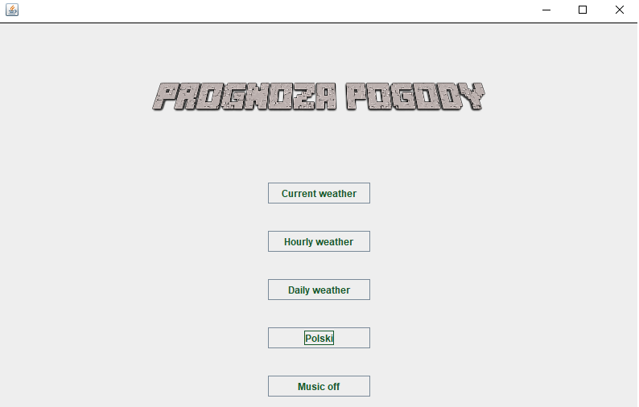
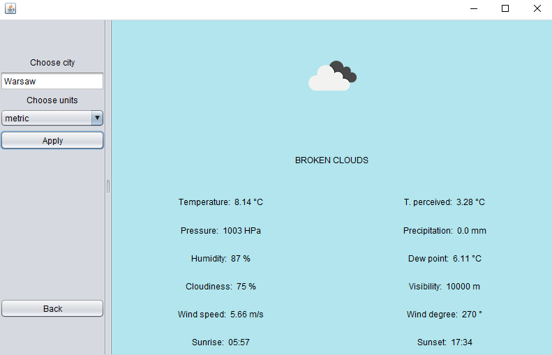
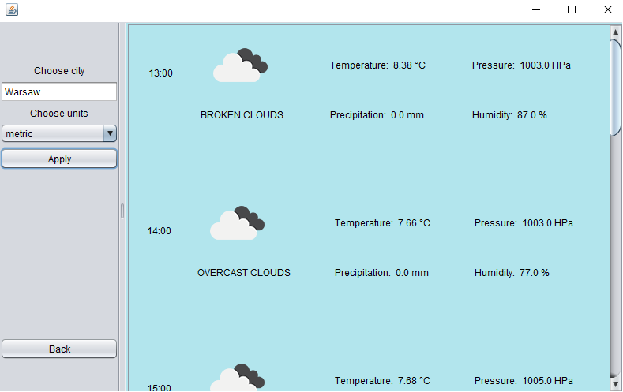
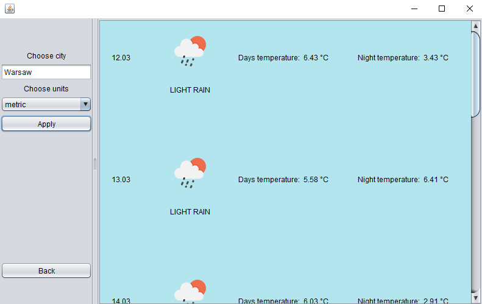

## Weather app

Project made for Advanced Object-Oriented and Functional by Maciej Gryszkiewicz, Miłosz Mazur and Maciej Chylak .

In the main menu user can choose three options of weather prediction: current, hourly and daily. User is also able to change language of the app on English or Polish. 

After clicking one of three weather buttons, user have to insert city name and choose metric system. On the right panel adequate prediction will be shown

